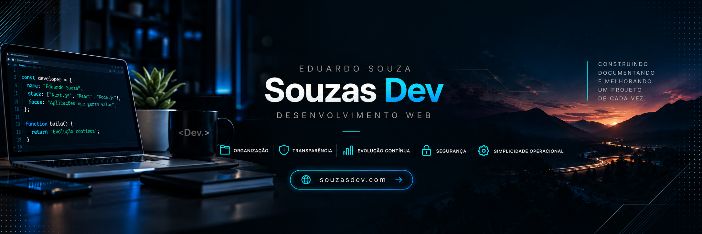



  

Desenvolvimento web com foco em aplicações bem estruturadas, documentação e evolução contínua.

[Site](https://souzasdev.com) · [GitHub](https://github.com/Souzas-Dev)

---

## Sobre

Desenvolvedor web em evolução contínua, trabalhando principalmente com **TypeScript, Next.js, React, Node.js e PostgreSQL**.

Na Souzas Dev, desenvolvo aplicações, sites institucionais e projetos conceituais com atenção a:

- arquitetura e organização do código;
- segurança;
- documentação técnica;
- testes e validações;
- integração contínua;
- manutenção e evolução do projeto;
- transparência sobre o que está implementado e o que ainda está planejado.

---

  

### Cartevy CRM

Aplicação web em desenvolvimento para acompanhamento da rotina comercial, incluindo clientes, pedidos, vendas, follow-ups e encomendas.

O projeto possui arquitetura documentada, persistência PostgreSQL, autenticação própria server-side, migrations versionadas, testes automatizados e integração contínua.

**Stack**

`Next.js` · `React` · `TypeScript` · `PostgreSQL` · `Supabase` · `Prisma` · `Vitest` · `GitHub Actions`

[Ver repositório](https://github.com/Souzas-Dev/cartevy-crm)

---

### Estação Café & Prosa

Projeto conceitual criado para o portfólio da Souzas Dev.

A proposta explora uma experiência visual moderna para uma cafeteria, com navegação responsiva, catálogo e interações desenvolvidas em uma aplicação Next.js.

**Stack**

`Next.js` · `React` · `TypeScript` · `CSS`

[Ver repositório](https://github.com/Souzas-Dev/estacao-cafe-prosa)

---

### Clínica SER — Demonstração Conceitual

Demonstração de site institucional desenvolvida para portfólio e apresentação comercial.

O projeto é identificado explicitamente como **demonstração conceitual** e não representa um trabalho contratado ou site oficial.

**Stack**

`HTML` · `CSS` · `JavaScript`

[Ver repositório](https://github.com/Souzas-Dev/clinica-ser-demo)

---

## Tecnologias

### Desenvolvimento

### Dados e infraestrutura

### Qualidade e workflow

---

## Processo de desenvolvimento

Meu fluxo de trabalho busca manter cada mudança rastreável e validada:

~~~text
planejamento
    ↓
branch de trabalho
    ↓
implementação
    ↓
testes / lint / build
    ↓
Pull Request
    ↓
CI
    ↓
squash merge
    ↓
main
~~~

Decisões técnicas importantes são documentadas durante a evolução dos projetos, incluindo arquitetura, persistência, segurança e limites de escopo.

---

## Princípios

`organização` · `transparência` · `responsabilidade` · `evolução contínua` · `segurança` · `simplicidade operacional`

---

  

## Sobre a Souzas Dev

A **Souzas Dev** é meu espaço de desenvolvimento web, onde concentro aplicações próprias, projetos conceituais, experimentação técnica e evolução profissional.

Projetos apresentados como demonstrações são identificados dessa forma. Funcionalidades são descritas de acordo com seu estado real de implementação.

**Site:** [souzasdev.com](https://souzasdev.com)

**GitHub:** [github.com/Souzas-Dev](https://github.com/Souzas-Dev)

---

Construindo, documentando e melhorando um projeto de cada vez.

